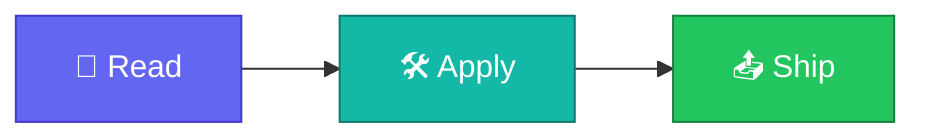

<p align="center">
  
</p>

<h1 align="center">http-status-cheatsheet</h1>

<p align="center">
  <strong>EN</strong> Markdown table of common HTTP status codes with short meanings.<br/>
  <strong>PT</strong> Tabela Markdown dos códigos HTTP comuns com significados curtos.
</p>

<p align="center">
  <a href="https://github.com/manansbdb/http-status-cheatsheet/blob/main/LICENSE"></a>
  
  
  <a href="#support--apoio"></a>
</p>

---

## What it does / Para que serve

| English | Português |
|---------|-----------|
| Markdown table of common HTTP status codes with short meanings. | Tabela Markdown dos códigos HTTP comuns com significados curtos. |



---

## Install / Instalação

### 1) Clone

```bash
git clone https://github.com/manansbdb/http-status-cheatsheet.git
cd http-status-cheatsheet
```

### Use / Usar

```bash
# open the files in this repo and copy what you need into your project
ls
```

### Requirements / Requisitos

- `git`
- No paid services required / Sem serviços pagos

---

## What's included / O que inclui

| Code | EN | PT |
|------|----|----|
| 200 | OK | OK |
| 201 | Created | Criado |
| 204 | No Content | Sem conteúdo |
| 400 | Bad Request | Pedido inválido |
| 401 | Unauthorized | Não autenticado |
| 403 | Forbidden | Proibido |
| 404 | Not Found | Não encontrado |
| 500 | Internal Server Error | Erro interno do servidor |

---

## Support / Apoio

Bitcoin donations welcome / Doações em Bitcoin bem-vindas:

```
bc1q0qfnlnxyum9u45stzxe0a7jnhtj4j0usfkqdjw
```

**Network / Rede:** BTC (Bech32).

---

## License / Licença

[MIT](./LICENSE) © 2026 manansbdb
